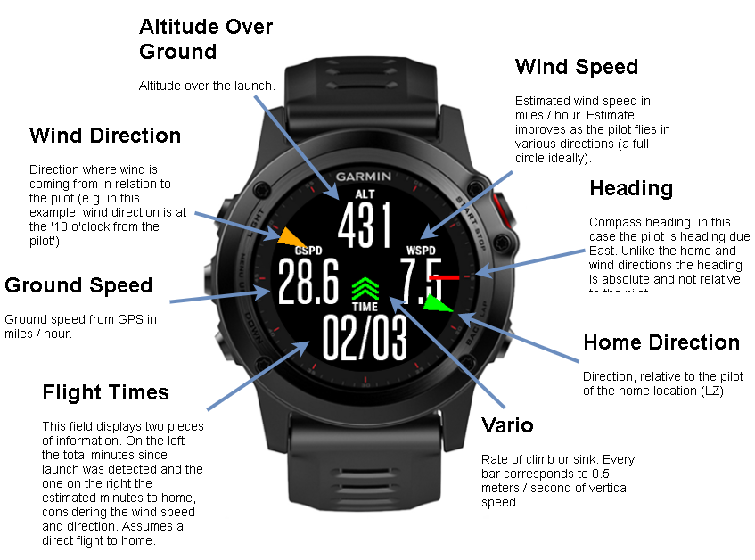
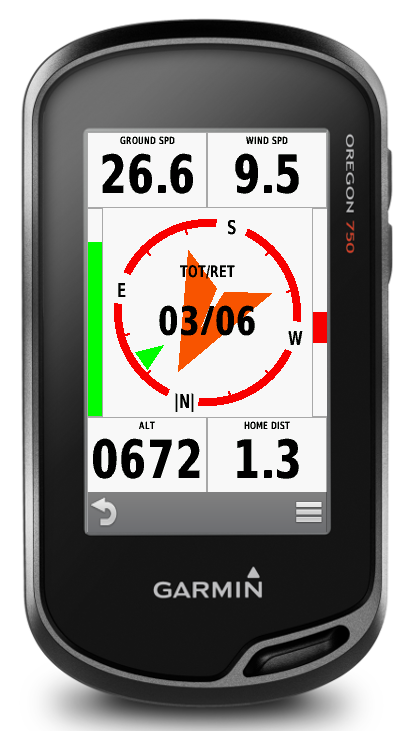

# PPGPilot

Garmin Connect IQ app for Powered Paragliding Pilots (PPG). Displays information needed in most flights like speed, altitude and direction to home (launch). In addition it calculates the wind direction and speed by just using GPS ground speed and direction. Since this is an indirect measurement the estimate improves as the pilot changes direction of flight. To get an accurate initial estimate a full circle should be flown.   

The estimated wind speed and direction is also used to improve the time to home calculation.

There are two app layouts, one for round displays and another for rectangular.

The Fenix 3 layout, explained.

The Oregon layout.

 
# Installation

The app was originally developed for personal use so it is not yet submitted to the Garmin IQ app store. It can be manually installed by connecting your device to a computer using a USB cable and manually copping the app binary to the D:\GARMIN\APPS directory (the drive letter may need to be updated for your setup). The app binary for your device can be found in the [Releases](https://github.com/vassilisv/PPGPilot/releases). If you can't find your device, you can either compile it yourself using the Garmin IQ SDK or submit an issue.
 
# TODO

- Use forecasted wind direction and speed to initialize before takeoff
- Add options menu (desired flight duration etc)
- Use sunset to cap flight duration if flying in evenings
- Display map (for devices that support it)
- Display additional fields in new screen (e.g. time to sundown, air speed, estimated speed to home, wind estimation bins, time of day)

